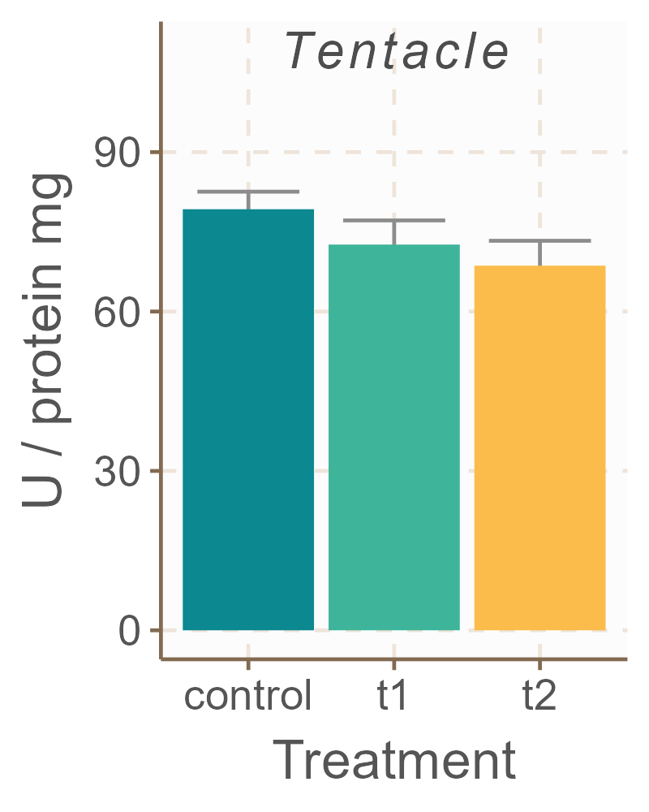
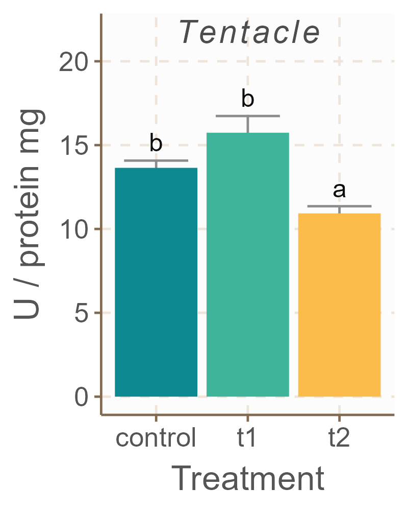
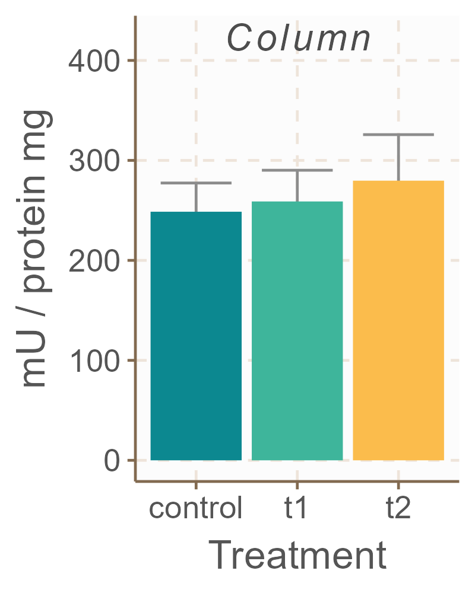
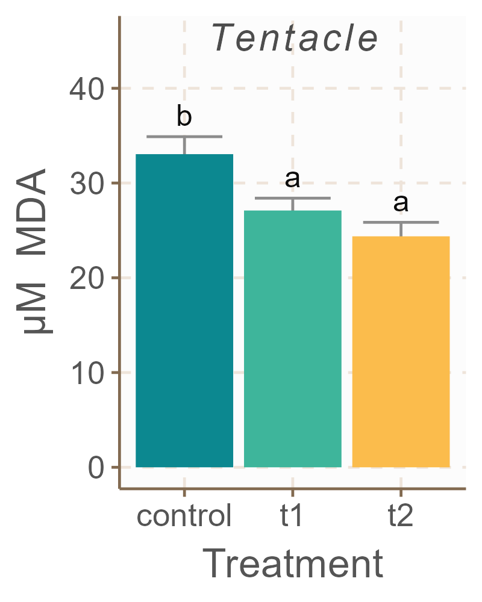

```{r setup, include=FALSE}
# Directorio en lab: "C:/Users/Usuario/Documents/GitHub/Revision_datos_TFG"
# Directorio en portatil: "D:/collf/Documents/GitHub/Revision_datos_TFG"
knitr::opts_knit$set(root.dir = "C:/Users/Usuario/Documents/GitHub/Revision_datos_TFG")
knitr::opts_chunk$set(fig.width=6, fig.height=3, fig.align = "center") 

library(tidyverse)
library(ggthemr)
library(multcompView)

```

# Introducción y estructura de los datos

Todo el análisis estadístico lo he realizado utilizando R 4.3.0 y RStudio 2023.12.0. Para esta parte de los datos de mi TFG, he utilizado únicamente las ortiguillas en cultivo. He comparado el grupo control (que no fue cortado) con el que he llamado t1 (las que fueron cortadas), y su equivalente grupo t2 (las ortiguillas cortadas, en el segundo muestreo al final del estudio). No he diferenciado entre organismos procedentes de una playa u otra.

El objetivo principal es comprobar cómo responden las anémonas a la reproducción asexual en condiciones de cultivo. Para ello, se midieron distintas enzimas involucradas en sistemas antioxidantes del animal (**SOD**, **CAT**, **GPx**, **GR**, **GST**, **DTD** y **G6PDH**), además de su capacidad antioxidante total (**TEAC**), su concentración de **proteína**, y su concentración de malondialdehído (**MDA**). Estas variables se midieron por duplicado, tanto en los tentáculos del animal como en su tronco o pie, por lo que en total hacen 20 variables de interés.

# Metodología y elección del modelo

Para examinar esta pregunta de investigación, he comprobado que las variables respuesta siguen una distribución aproximadamente normal, y he transformado logarítmicamente las variables que no cumplían este requisito. Una vez hecho esto, he utilizado un anova de una vía para comparar las medias entre los tres grupos. En caso de encontrarse diferencias significativas, utilicé un test de Tukey como test post-hoc para evaluar dichas diferencias. Una vez ajustados los modelos estadísticos, evalué las asunciones de normalidad de los residuos y homocedaticidad mediante examinación de la gráfica Q-Q y test de Levene, respectivamente,

Las variables que requirieron una transformación logarítmica fueron la GPx y G6PDH en el disco pedio; y la SOD, CAT, GR y GST en tentáculo.

Finalmente, he expuesto los resultados del análisis en gráficas de barras. Para tenerlo lo antes posible, no las he retocado mucho, así que le faltan cosas como el título. Además, podrían utilizarse diagramas de cajas en vez de gráficas de barras en este caso concreto, ya que tenemos buen tamaño de muestra. Eso es, las graficas no son definitivas, son para que sepas el resultado del análisis.

# Resultados

## Superóxido dismutasa (SOD)





La actividad SOD en el pie presenta sólo diferencias marginalmente significativas entre los tres grupos, por lo que no se realizó test post hoc. Para la SOD tentacular, no hay diferencias significativas entre grupos

## Catalasa (CAT)


De nuevo tenemos diferencias marginalmente significativas en el pie, ahora para la catalasa. Parece haber una tendencia a que su actividad se incrementa con el corte y aun mas al pasar el tiempo, pero no hay evidencia estadística con nuestros datos. En la CAT tentacular si que vemos diferencias claramente significativas, y un patron que se repite consistentemente a lo largo de otras variables: la actividad de la enzima se icnrementa en el grupo que ha recibido el corte recientemente, pero pasado el tiempo vuelve a valores similares a los del control inicial.


## Glutatión peroxidasa (GPx)


En el caso de la GPx en pie, los resultados son sólo marginalmente significativos por la mala calidad de los datos, que tenian algunos valores no disponibles y mucha dispersion en general. Aun asi podemos ver cierta tendencia. Este modelo cogerlo con pinzas porque la distribucion de los residuos se alejaba mas de la normal de lo que debería. Para la GPx en tentáculo no aparecen diferencias algunas, quizás por la calidad de los datos o quizás porque realmente no hay efecto.


## Glutatión reductasa (GR)




En el pie volvemos a tener el mismo patrón: la acitivdad de la GR en el pie se incrementa tras el corte, pero luego se recupera con el paso del tiempo. En tentáculo tenemos diferencias significativas en el último grupo, que tiene niveles inferiores al resto.

## Glutatión-S transferasa (GST)




En la GST pedia no aparecen diferencias significativas.Sin embargo, vuelve a aparecer de nuevo el mismo patron en la GST tentacular, con diferencias significativas.

## DT diaforasa (DTD)


Aunque se intuye un patrón ascendente, no hay diferencias significativas ni marginalmente significativas entre grupos para la DTD en el pie. En tentáculo, de nuevo el mismo patrón. Parece que está presente en muchas enzimas medidas en tentáculo y en alguna en el pie.


## Glucosa-6-P deshidrogenasa (G6PDH)


Para el pie, no encontramos diferencias significativas pese al patrón descendente, que puede ser producto del tamaño de muestra, dispersion de los datos (por azar), o simplemente que no haya una diferencia real. En tentáculo se detectaron diferencias marginalmente significativas, aunque se ve un patron bastante evidente.

## Capacidad antioxidante total (TEAC)


No hay diferencias ni en pie ni en tentáculo

## Malondialdehído (MDA)




En el pie, hay diferencias marginalmente significativas con un patrón descendente. En tentáculo aparece el mismo patrón, pero aquí si que obtenemos significación estadística, y vemos que en el grupo control hay mayor concentración de MDA que en los otros dos.

## Proteína


Parece que la ceoncentracion de proteina en el pie disminuye tras el corte aunque la magnitud del efecto no es muy grande. En tentáculo no hay ningún efecto significativo.

# Conclusiones

-  La CAT tentacular, GR pedia y tentacular, GST tentacular y DTD tentacular muestran el mismo patrón: su actividad se incrementa al inducir la reproducción asexual en las anémonas, pero posteriormente se recuperaen niveles similares o inferiores al control previo.

-  El MDA en tentáculo muestra que las anemonas cortadas mostraron valores inferiores a las del control, pero en pie no se repite el patrón.

-  Ni el TEAC ni la SOD muestran variación entre grupos

-  La G6PDH en tentáculo muestra un patrón curioso, similar al del MDA, pero no hay mucha evidencia estadística que lo respalde.

-  La GPx muestra patrones curiosos, pero fue uno de los peores modelos en cuanto a ajuste por lo que los resultados para esta enzima son menos robustos.
